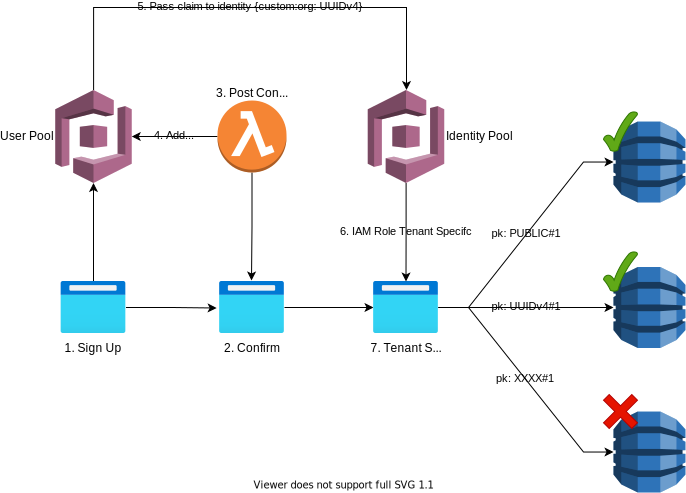
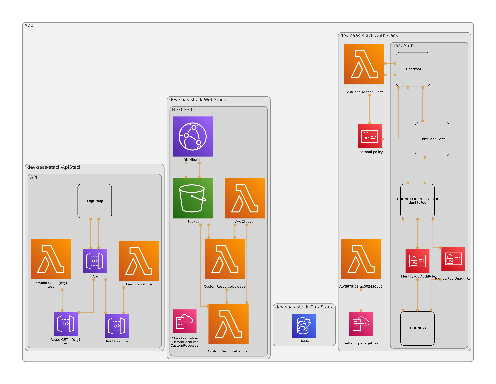

# Saas Stack

> Deploying multi-tenanted applications using serverless stack and seed

Creating a construct for Cognito SaaS Multi-tenancy when using Federated Access.

- [Saas Stack](#saas-stack)
  - [How it Works](#how-it-works)
  - [Stacks](#stacks)
  - [Demonstration](#demonstration)
  - [Data Segregation Supported](#data-segregation-supported)
  - [Reading](#reading)

## How it Works

This stack deploys, cognito user and identity pools, and a dynamoDB table.

As part of the deploy, a custom resource runs that forwards the value of `custom:org` in the Cognito Users JWT, to the role assumed by authenticated identities.

This, then, in conjunction with IAM conditions, prevents the client side reading of any data, other than that of the users e.g.

## Stacks

## Demonstration

There is a site setup to demonstrate this here: https://d1mmk10lcvudwp.cloudfront.net/

## Data Segregation Supported

| Data type                         | Segregation method                                                                                                                                    |
| --------------------------------- | ----------------------------------------------------------------------------------------------------------------------------------------------------- |
| DynamoDB data for the public      | Secured using fine grained access control, primary key must begin with `PUBLIC#`                                                                      |
| DynamoDB data for an organisation | Secured via fine grained access control, primary key must begin with the organisations UUID v4 `<uuidv4>#`                                            |
| API Gateway                       | Secured via fine grained access control, API can only be accessed on routes with the organisations UUID v4 as the base parameter `GET /<uuidV4>/test` |

## Reading

> What you should probably know to iterate on this stack

Check out this cool video by AWS demonstrating how to set this up in the console. https://www.youtube.com/watch?v=tAUmz94O2Qo

Then we can authenticate with this guide (https://docs.aws.amazon.com/sdk-for-javascript/v3/developer-guide/loading-browser-credentials-cognito.html) to test the IAM roles assumed by the identities.

String operators that work for us: https://docs.aws.amazon.com/IAM/latest/UserGuide/reference_policies_elements_condition_operators.html#Conditions_String
