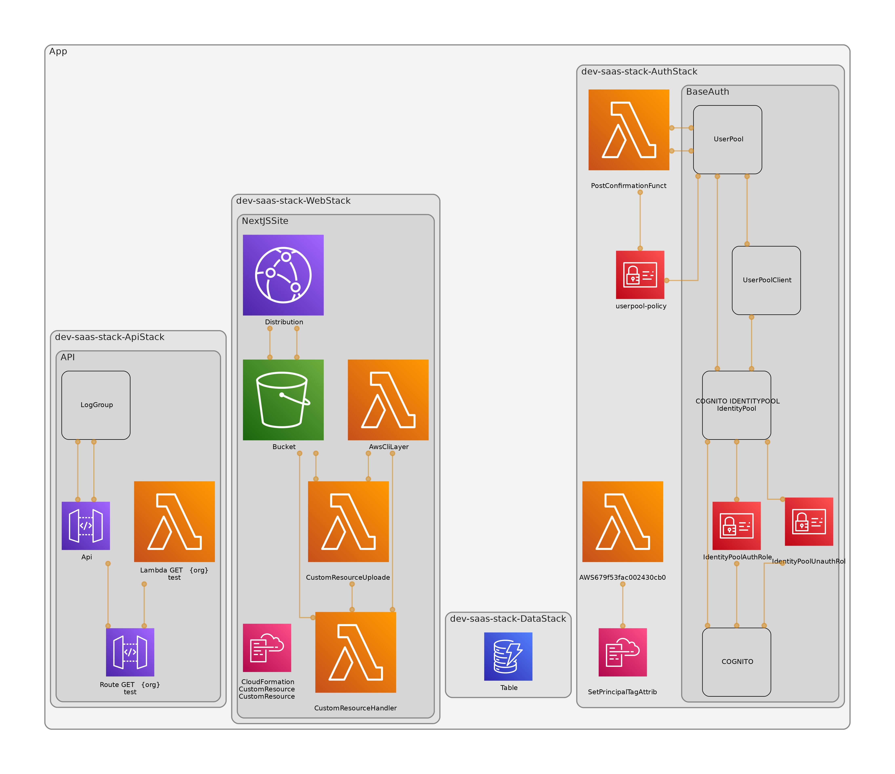

# Identity Attributes

Creating a construct for Cognito SaaS Multi-tenancy when using Federated Access.

- [Identity Attributes](#identity-attributes)
  - [How it Works](#how-it-works)
  - [Stacks](#stacks)
  - [Demonstration](#demonstration)
  - [To Do](#to-do)
  - [Reading](#reading)

## How it Works

This stack deploys, cognito user and identity pools, and a dynamoDB table.

As part of the deploy, a custom resource runs that forwards the value of `custom:org` in the Cognito Users JWT, to the role assumed by authenticated identities.

This, then, in conjunction with IAM conditions, prevents the client side reading of any data, other than that of the usrs e.g.

## Stacks

## Demonstration

There is a site setup to demonstrate this here:

## To Do

- [x] Create custom resource that sets principal identity attributes on the federated identities.
- [x] Create policies which use in fine-grained access control.
- [x] Setup site for cognito authentication:
  - [x] https://serverless-stack.com/chapters/using-cognito-to-add-authentication-to-a-serverless-app.html
- [x] Demonstrate solutions for:
  - [x] Public information
  - [x] Private information shared by many users in the tenant
  - [ ] Private information, belonging only to that tenant

Plan to build polices that can be used with federated identities, and are still scoped specifically to tenant features.

## Reading

Check out this cool video by AWS demonstrating how to set this up in the console. https://www.youtube.com/watch?v=tAUmz94O2Qo

Then we can authenticate with this guide (https://docs.aws.amazon.com/sdk-for-javascript/v3/developer-guide/loading-browser-credentials-cognito.html) to test the IAM roles assumed by the identities.

String operators that work for us: https://docs.aws.amazon.com/IAM/latest/UserGuide/reference_policies_elements_condition_operators.html#Conditions_String
